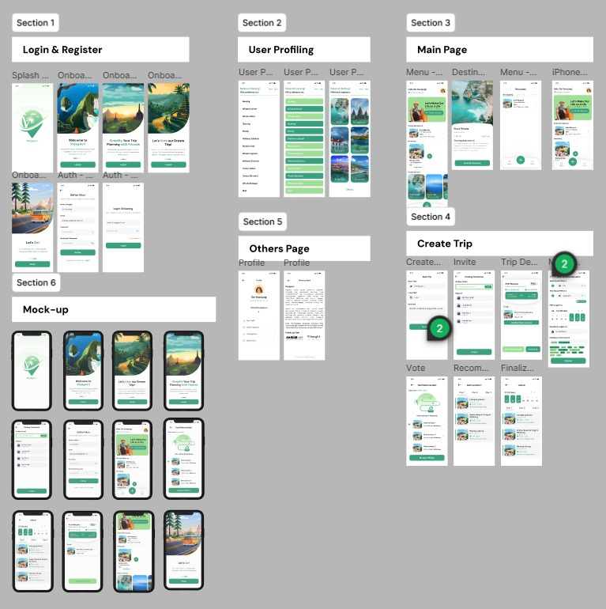
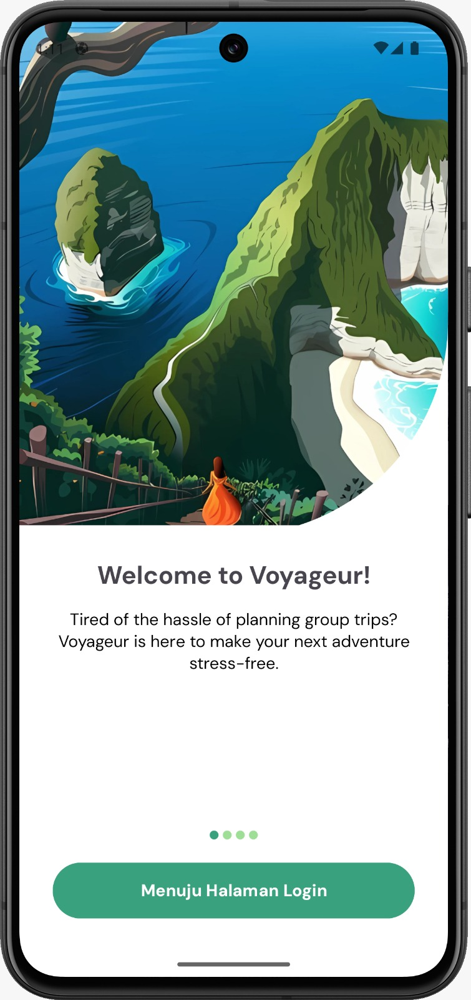
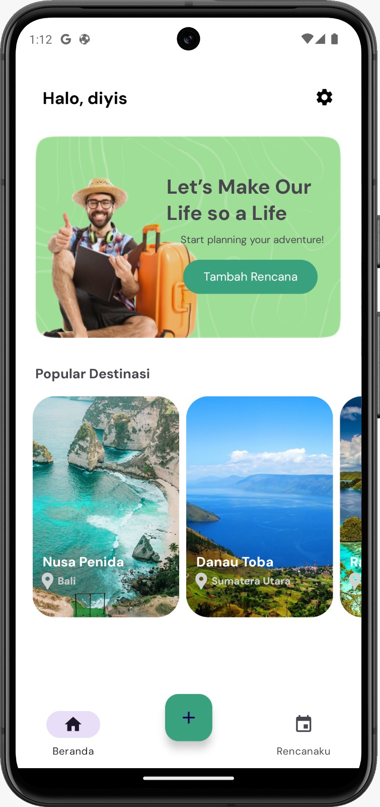
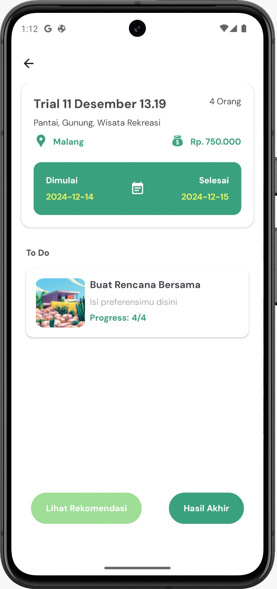
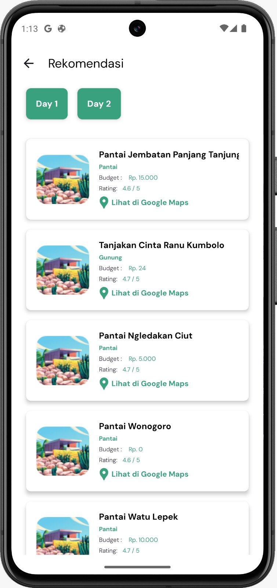
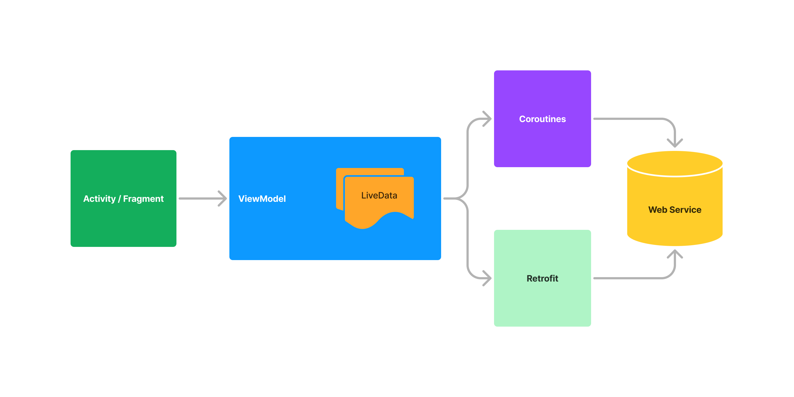

# Mobile Development
Using the [Kotlin programming language](https://kotlinlang.org/) to develop applications. Using [Retrofit](https://square.github.io/retrofit/) to handle all things related to data connection from android to the internet. Using [Google Cloud](https://cloud.google.com/) to fetch API, store user data and to authenticate login and register systems.

## Preview Figma
<p align="center">
	 
</p>

## Preview Mobile Apps
<p align="center">
	 &nbsp; &nbsp; &nbsp;
	 &nbsp; &nbsp; &nbsp;
	 &nbsp; &nbsp; &nbsp;
  
</p>

# Android Architecture
<p align="center">
	 
</p>

## Tech Stack
### Programming Language
- **Kotlin**: Leverage Kotlin's concise syntax and modern features to build a robust and maintainable codebase.

### Networking
- **Retrofit**: Handle all network communications between the Android client and the backend server.

### Cloud Services
- **Google Cloud**: Utilize Google Cloud for:
  - Fetching APIs for data interactions.
  - Storing user data securely.
  - Authenticating login and registration systems.

### Asynchronous Programming
- **Coroutines**: Handle asynchronous tasks efficiently and improve code readability.

## Project Structure
The project follows a modular MVVM (Model-View-ViewModel) architecture to ensure scalability and maintainability.

## Setup Instructions

### Prerequisites
- Android Studio Ladybug or later

### Installation Steps
1. Clone the repository:
   ```bash
   git clone https://github.com/Voyageur-Team/MobileDevelopment.git
   cd voyageur
2. Open the project in Android Studio.
3. Sync the project with Gradle.
4. Run the application on an emulator or a physical device.

## Features
1. **User Authentication**
   - Handles user login, registration, and session management.
   - Utilizes Google Cloud Authentication services.

2. **Task Management**
   - Create trip and track tasks within a group.
   - Sync tasks with the server using Retrofit.

3. **Trip Recommendations**
   - Generate trip recommendations
   - Generate Itinerary trip
---

<p align="center">
  <strong>Discover Together, Explore With Voyageur</strong>
</p>


